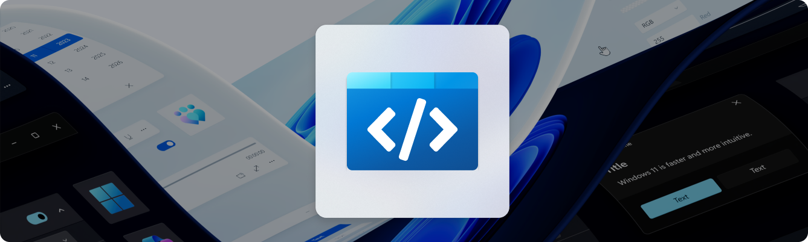

<h1 align="center">
    WinUI 3 Gallery
</h1>
<p align="center">
  <a href="https://apps.microsoft.com/detail/9P3JFPWWDZRC?launch=true&mode=mini">
    </a>
</p>

## ⭐️ Accompanying samples for [WinAppSDK](https://github.com/microsoft/WindowsAppSDK)

This app demonstrates all of the WinUI 3 controls and styles available to make a modern Windows app with the [Windows App SDK](https://github.com/microsoft/WindowsAppSDK). It is the interactive companion to the [Fluent Design Guidelines](https://docs.microsoft.com/windows/apps/design/basics/) and shows the usage of the [WinUI](https://docs.microsoft.com/windows/apps/winui/) APIs.

- **WinUI Controls Samples:** Each control page shows the markup and codebehind used to create each example.
- **Use the Microsoft.UI.Xaml (WinUI) Library:** The app includes the latest WinUI NuGet package and shows how to use the [WinUI](https://docs.microsoft.com/windows/apps/winui/) controls like NavigationView, SwipeControl, and more.
- **Basic Layout:** This sample will show all of the possible layout options for your app and allow you to interact with the panels to show how to achieve any layout you are looking for.
- **Adaptive UI:** In addition to showing how each control responds to different form factors, the app itself is responsive and shows various methods for achieving adaptive UI.
- **Design & Accessibility Guidance**: Design and accessibility pages help make the gallery a useful developer companion app. 
- **Version Adaptive Code:** This sample shows how to write version adaptive code so that the app can run on previous versions of Windows while also using the latest capabilities on the most recent verison of Windows.


## 📢 Contributing to WinUI Gallery

Any samples or docs improvements you'd like to see? We're always looking for a helping hand. Feel free to file an issue to start the discussion, or even better, create a PR with the change you'd like to see!

Check out these [help wanted](https://github.com/microsoft/WinUI-Gallery/issues?q=is%3Aopen+is%3Aissue+label%3A%22help+wanted%22) issues if you don't know where to start.

You can also learn more about current happenings with WinUI Gallery in the [project board](https://github.com/orgs/microsoft/projects/368).

## 🚀 Getting started with WinUI Gallery

Quick start guide to building WinUI 3 Gallery locally:

### 1. Set up the Environment

> [!NOTE]
> The WinUI 3 Gallery requires [Visual Studio 2022](https://visualstudio.microsoft.com/vs/) or later to build and Windows 10 or later to execute.
If you're building an app with the Windows App SDK for the first time, follow the [installation instructions here.](https://learn.microsoft.com/en-us/windows/apps/windows-app-sdk/set-up-your-development-environment)

**Required [Visual Studio components](https://learn.microsoft.com/en-us/windows/apps/windows-app-sdk/set-up-your-development-environment?tabs=cs-vs-community%2Ccpp-vs-community%2Cvs-2022-17-1-a%2Cvs-2022-17-1-b#required-workloads-and-components):**
- .NET Desktop Development.
- Windows App SDK C# Templates
- Windows 10 SDK (10.0.19041.0)

### 2. Clone the Repository

```shell
git clone https://github.com/microsoft/WinUI-Gallery.git
```

### 3. Open .sln with Visual Studio and Build!
```shell
.\WinUIGallery\WinUIGallery.DesktopWap.sln
```
Make sure to select `WinUIGallery.DesktopWap.Package` for startup project in Visual Studio.

## 🪟 Further information

To obtain information about Windows 11 development, go to the [Windows Dev Center](https://developer.microsoft.com/windows)  
To contact the authors, please reach out to ControlsGallery@microsoft.com

### Related topics

- [Get started with building WinUI apps](https://learn.microsoft.com/en-us/windows/apps/get-started/start-here)  
- [WinUI](https://aka.ms/windev)  
- [Template Studio for WinUI](https://marketplace.visualstudio.com/items?itemName=TemplateStudio.TemplateStudioForWinUICs)

###  Related samples

- [RSS reader sample](https://github.com/Microsoft/Windows-appsample-rssreader)  
- [Lunch Scheduler app sample](https://github.com/Microsoft/Windows-appsample-lunch-scheduler)  
- [Customers Orders Database sample](https://github.com/Microsoft/Windows-appsample-customers-orders-database)

## 🏆 Contributors
Thanks to our amazing contributors!

[](https://github.com/microsoft/WinUI-Gallery/graphs/contributors)

Made with [contrib.rocks](https://contrib.rocks).
