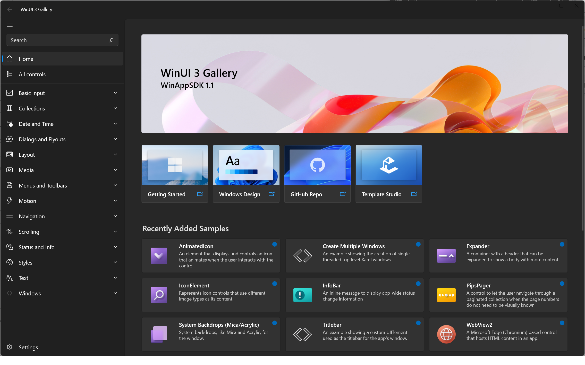

# WinUI Gallery

  

Accompanying Sample App for [WinAppSDK](https://github.com/microsoft/WindowsAppSDK)

Shows all of the XAML UI components in an interactive format. This app is the interactive companion to the [Fluent Design Guidelines](https://docs.microsoft.com/windows/apps/design/basics/) and shows the usage of the [WinUI](https://docs.microsoft.com/windows/apps/winui/) APIs. 

## The WinUI Gallery shows how to:

- **Specify XAML controls in markup:** Each control page shows the markup used to create each example.
- **Use the Microsoft.UI.Xaml (WinUI) Library:** The app includes the latest WinUI NuGet package and shows how to use the [WinUI](https://docs.microsoft.com/windows/apps/winui/) controls like NavigationView, SwipeControl, and more.
- **Basic layout:** This sample will show all of the possible layout options for your app and allow you to interact with the panels to show how to achieve any layout you are looking for.
- **Adaptive UI:** In addition to showing how each control responds to different form factors, the app itself is responsive and shows various methods for achieving adaptive UI.
- **Version adaptive code:** This sample shows how to write version adaptive code so that the app can run on previous versions of Windows while also using the latest capabilities on the most recent verison of Windows.

## Further information

>**Note**: The WinUI 3 Gallery requires [Visual Studio 2022](https://visualstudio.microsoft.com/vs/) or later to build and Windows 10 or later to execute.
If you're building an app with the Windows App SDK for the first time, follow the [installation instructions here.](https://learn.microsoft.com/en-us/windows/apps/windows-app-sdk/set-up-your-development-environment)

To obtain information about Windows 11 development, go to the [Windows Dev Center](https://developer.microsoft.com/windows)

To obtain information about Microsoft Visual Studio and the tools for developing Windows apps, go to [Visual Studio](http://go.microsoft.com/fwlink/?LinkID=532422)

To contact the authors, please reach out to ControlsGallery@microsoft.com

## Related topics

[Get started with Windows 11 apps](https://docs.microsoft.com/windows/apps/get-started)  

[Install a prebuilt version of this app from Microsoft Store](https://www.microsoft.com/store/productId/9P3JFPWWDZRC). Each control page in the application has links to relevant Microsoft Docs for that control.

[Windows UI Library (WinUI)](https://docs.microsoft.com/windows/apps/winui)

[Template Studio for WinUI](https://marketplace.visualstudio.com/items?itemName=TemplateStudio.TemplateStudioForWinUICs)

## Related samples

[RSS reader sample](https://github.com/Microsoft/Windows-appsample-rssreader)  
[Lunch Scheduler app sample](https://github.com/Microsoft/Windows-appsample-lunch-scheduler)  
[Customers Orders Database sample](https://github.com/Microsoft/Windows-appsample-customers-orders-database)
