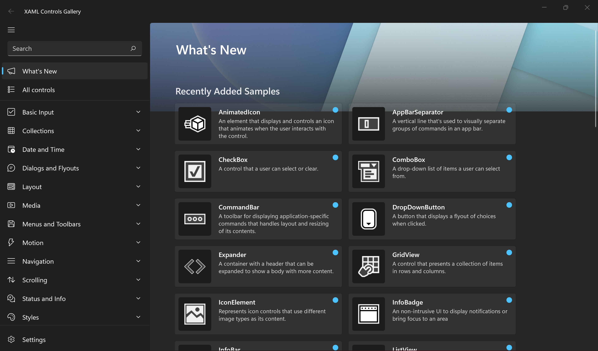

> **Note:** WinUI 3 Alpha is in the `winui3alpha` branch. So after cloning, make sure you checkout the branch, or use this command line to create the clone:

> `git clone --single-branch --branch winui3alpha https://github.com/microsoft/Xaml-Controls-Gallery.git`

# XAML Controls Gallery

Shows all of the XAML controls in an interactive format. This app is the interactive companion to the [Fluent Design Guidelines](https://docs.microsoft.com/windows/uwp/design/basics/) and shows the usage of both UWP Xaml APIs and [Windows UI Toolkit](https://docs.microsoft.com/uwp/toolkits/winui/) APIs.

This sample shows how to:

- **Specify XAML controls in markup:** Each control page shows the markup used to create each example.
- **Use the Microsoft.UI.Xaml (WinUI) Library:** The app includes the latest WinUI NuGet package and shows how to use the [Windows UI Toolkit](https://docs.microsoft.com/uwp/toolkits/winui/) controls like NavigationView, SwipeControl, and more.
- **Basic layout:** This sample will show all of the possible layout options for your app and allow you to interact with the panels to show how to achieve any layout you are looking for.
- **Adaptive UI:** In addition to showing how each control responds to different form factors, the app itself is responsive and shows various methods for achieving adaptive UI.
- **Version adaptive code:** This sample shows how to write version adaptive code so that the app can run on previous versions of Windows while also using the latest capabilities on the most recent verison of Windows.

**Note** The Xaml Controls Gallery requires Visual Studio [2017](http://go.microsoft.com/fwlink/?LinkID=532422) or [2019](https://visualstudio.microsoft.com/vs/) to build and Windows 10 to execute.

To obtain information about Windows 10 development, go to the [Windows Dev Center](https://developer.microsoft.com/windows)

To obtain information about Microsoft Visual Studio and the tools for developing Windows apps, go to [Visual Studio](http://go.microsoft.com/fwlink/?LinkID=532422)

To contact the authors, please reach out to ControlsGallery@microsoft.com

## Related topics

[Get started with Windows 10 apps](https://docs.microsoft.com/windows/uwp/get-started/)  

[Install a prebuilt version of this sample](https://www.microsoft.com/store/productId/9MSVH128X2ZT). Each control page in the application has links to relevant Microsoft Docs for that control.

[Windows UI Library (WinUI)](https://docs.microsoft.com/uwp/toolkits/winui/)

## Related samples

[RSS reader sample](https://github.com/Microsoft/Windows-appsample-rssreader)  
[Lunch Scheduler app sample](https://github.com/Microsoft/Windows-appsample-lunch-scheduler)  
[Customers Orders Database sample](https://github.com/Microsoft/Windows-appsample-customers-orders-database)  
[Universal Windows Platform (UWP) Samples](https://github.com/Microsoft/Windows-universal-samples/tree/dev)
