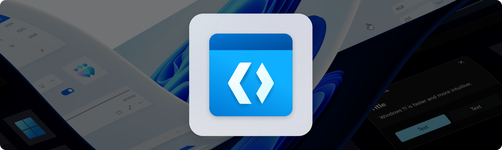
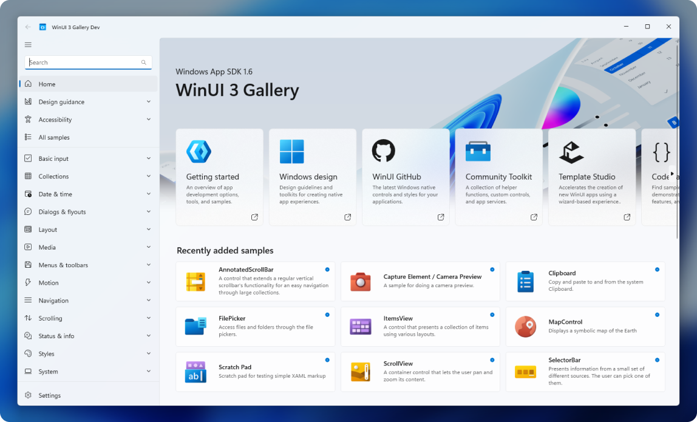

<h1 align="center">WinUI 3 Gallery</h1>
<p align="center">Companion app for <a style="text-decoration:none" href="https://docs.microsoft.com/windows/apps/winui">WinUI</a> & <a style="text-decoration:none" href="https://github.com/microsoft/WindowsAppSDK">Windows App SDK</a> APIs</p>


This app demonstrates all of the WinUI 3 controls and styles available to make a modern Windows app with the Windows App SDK. It is the interactive companion to the [Fluent Design guidelines](https://docs.microsoft.com/windows/apps/design/basics/) and shows the usage of [WinUI](https://docs.microsoft.com/windows/apps/winui/) through interactive samples, tools and code snippets. 


<p align="center">
  
</p>
<p align="center">
  <a style="text-decoration:none" href="https://apps.microsoft.com/detail/9P3JFPWWDZRC?launch=true&mode=full">
    <picture>
      <source media="(prefers-color-scheme: light)" srcset="./.github/assets/StoreBadge-dark.png" width="220" />
      
  </picture></a>
</p>

## ⭐ Features

- **WinUI controls samples:** each control page shows the markup and codebehind used to create each example.

- **Use the Microsoft.UI.Xaml (WinUI) library:** the app includes the latest WinUI NuGet package and shows how to use the [WinUI](https://docs.microsoft.com/windows/apps/winui/) controls like NavigationView, SwipeControl, and more.

- **Adaptive UI:** in addition to showing how each control responds to different form factors, the app itself is responsive and shows various methods for achieving adaptive UI.

- **Design & accessibility guidance**: design and accessibility pages help make the gallery a useful developer companion app. 


## 👏 Contribute to WinUI Gallery

Any samples or docs improvements you'd like to see? We're always looking for a helping hand. Feel free to file an issue to start the discussion, or even better, create a PR with the change you'd like to see!

Check out these [help wanted](https://github.com/microsoft/WinUI-Gallery/issues?q=is%3Aopen+is%3Aissue+label%3A%22help+wanted%22) issues if you don't know where to start.

You can also learn more about current happenings with WinUI Gallery in the [project board](https://github.com/orgs/microsoft/projects/368).

## 🚀 Getting started

Quick start guide to building the WinUI 3 Gallery:


### 1. Set up the environment

> [!NOTE]
> The WinUI Gallery requires [Visual Studio 2022](https://visualstudio.microsoft.com/vs/) or later to build and Windows 10 or later to execute. If you're building an app with WinUI and Windows App SDK for the first time, follow these [installation instructions](https://learn.microsoft.com/windows/apps/get-started/start-here).

**Required [Visual Studio components](https://learn.microsoft.com/windows/apps/get-started/start-here?tabs=vs-2022-17-10#required-workloads-and-components):**
- Windows application development

### 2. Clone the Repository

```powershell
git clone https://github.com/microsoft/WinUI-Gallery.git
```

### 3. Open WinUIGallery.sln with Visual Studio and build!

Ensure that the `WinUIGallery` project is set as the startup project in Visual Studio.

> [!WARNING]
> Try deleting [`nuget.config`](nuget.config) and building again if you get the following build error:
> > Assets file 'C:\Users\\...\source\repos\WinUI-Gallery\WinUIGallery\obj\WinUIGallery\project.assets.json' not found. Run a NuGet package restore to generate this file.
>
> See [issue #1659: Broken repo build](https://github.com/microsoft/WinUI-Gallery/issues/1659).

## ➡️ Further information

To learn more about Windows app development, go to the [Windows Dev Center](https://developer.microsoft.com/windows).


### Related topics


- [Get started with WinUI](https://learn.microsoft.com/windows/apps/get-started/start-here)  
- [About WinUI](https://aka.ms/windev)
- [WinUI repository](https://github.com/microsoft/microsoft-ui-xaml)
- [WindowsAppSDK repository](https://github.com/microsoft/WindowsAppSDK)
- [WindowsAppSDK samples](https://github.com/microsoft/WindowsAppSDK-Samples)

## 🏆 Contributors
Thanks to our amazing contributors!

[](https://github.com/microsoft/WinUI-Gallery/graphs/contributors)

Made with [contrib.rocks](https://contrib.rocks).
