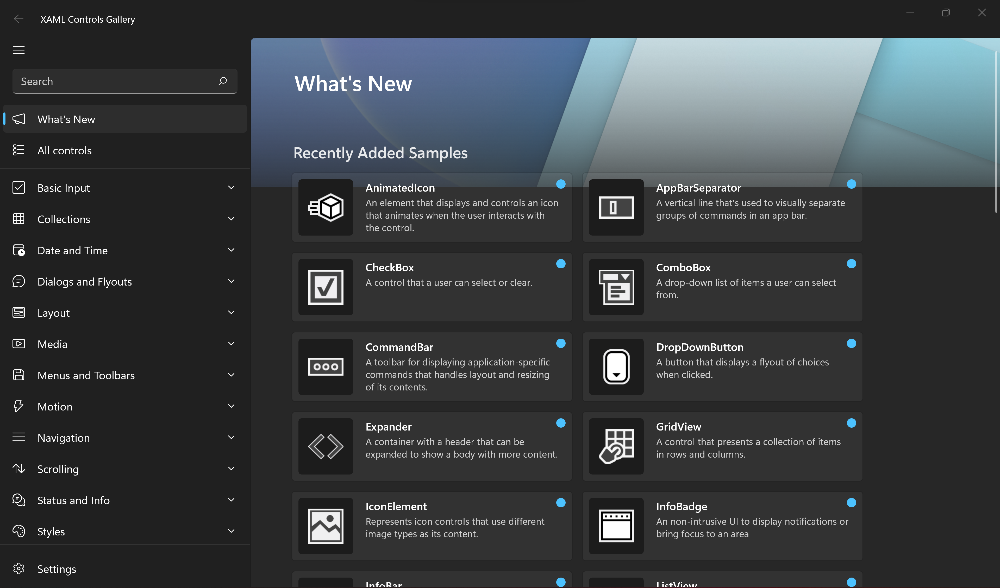

# WinUI 3 Gallery



[](https://dev.azure.com/stmoy/Xaml%20Controls%20Gallery/_build/latest?definitionId=2&branchName=master)

Shows XAML controls in an interactive format using WinUI 3 and the Windows App SDK.

## Building this migrated workspace

The application solution is `WinUIGallery\WinUIGallery.sln`. It targets .NET 8,
Windows SDK 10.0.19041, and Windows App SDK 2.4, while retaining Windows 10 build
17763 as its declared minimum OS. Supported architectures are x64, x86, and ARM64;
32-bit ARM is not supported by WinUI 3.

Use a .NET 8 or newer SDK, Visual Studio with WinUI development tools, and WinAppCLI.
From the repository root:

```powershell
pwsh -File .\scripts\New-DevelopmentCertificate.ps1
dotnet build .\WinUIGallery\WinUIGallery.sln -c Debug -p:Platform=x64
winapp run .\WinUIGallery\WinUIGallery.csproj --arch x64 --no-build
```

The certificate script requires PowerShell 7.3 or newer. It creates a **local-test-only**
certificate in the ignored `.certificates` folder, without installing it into a trust
store. Never commit or distribute its private key. The original sample certificate
has expired. For production signing, supply your own certificate using the
`PackageCertificateKeyFile` MSBuild property.

Development-signed MSIX output is under `WinUIGallery\AppPackages`. Debug and Release
retain their original, distinct package identities. Installing the migrated package
updates the corresponding same-identity app; this is not a separately Store-approved
Microsoft release. The existing `winui2gallery://category/...` and
`winui2gallery://item/...` links are retained and redirected to one running instance.

## Intentional platform differences

- InkCanvas and InkToolbar remain listed with explicit unsupported notices.
  Legacy Reveal effects are documented as unavailable; the Reveal Focus page keeps
  its high-visibility focus examples and disables the unavailable Reveal option.
- Desktop acrylic is demonstrated in owned desktop windows. In-app acrylic remains
  inside the sample page. WebView uses WebView2; media examples use MediaPlayerElement.
- Navigation saves a lightweight route checkpoint without invoking page teardown.
  Normal window closing saves full navigation history; after an abrupt exit, the
  latest checkpoint restores the last page rather than the entire back stack.
- Delayed screenshots capture the visible sample region, including flyouts. Keep
  the sample fully on-screen and unobscured; capture failures are shown in the UI.
- Dormant preview files excluded by the original project remain excluded. The
  separate legacy `UITests\UITests.sln` is not included in this application migration.

Unhandled exceptions are recorded in the app's `LocalState\Gallery-errors.log`
without suppressing the failure.

## The XAML Controls Gallery shows how to:

- **Specify XAML controls in markup:** Each control page shows the markup used to create each example.
- **Use the Microsoft.UI.Xaml (WinUI) Library:** The app includes the latest WinUI NuGet package and shows how to use the [Windows UI Library](https://docs.microsoft.com/windows/apps/winui/) controls like NavigationView, SwipeControl, and more.

- **Basic layout:** This sample will show all of the possible layout options for your app and allow you to interact with the panels to show how to achieve any layout you are looking for.
- **Adaptive UI:** In addition to showing how each control responds to different form factors, the app itself is responsive and shows various methods for achieving adaptive UI.
- **Version adaptive code:** This sample shows how to write version adaptive code so that the app can run on previous versions of Windows while also using the latest capabilities on the most recent version of Windows.

## Further information

> **Note**: This migrated solution requires current WinUI development tools rather than the original UWP Visual Studio 2017/2019 toolchain.

To obtain information about Windows 10 & 11 development, go to the [Windows Dev Center](https://developer.microsoft.com/windows)

To obtain information about Microsoft Visual Studio and the tools for developing Windows apps, go to [Visual Studio](http://go.microsoft.com/fwlink/?LinkID=532422)

## 🐞 Found a bug? Want a new sample?

If you find a bug **within the Xaml Controls Gallery** or want to request a new sample, please [file an issue](https://github.com/microsoft/Xaml-Controls-Gallery/issues/new/choose).

If you find a bug **within your app (not in the Xaml Controls Gallery)** and need help, please [file an issue on the WinUI repo](https://github.com/microsoft/microsoft-ui-xaml/issues/new/choose).


## Related topics

[Get started with Windows 10 apps](https://docs.microsoft.com/windows/uwp/get-started/)  

[Install a prebuilt version of this app from Microsoft Store](https://www.microsoft.com/store/productId/9MSVH128X2ZT). Each control page in the application has links to relevant Microsoft Docs for that control.

[Windows UI Library (WinUI)](https://docs.microsoft.com/uwp/toolkits/winui/)

## Related samples

[RSS reader sample](https://github.com/Microsoft/Windows-appsample-rssreader)  
[Lunch Scheduler app sample](https://github.com/Microsoft/Windows-appsample-lunch-scheduler)  
[Customers Orders Database sample](https://github.com/Microsoft/Windows-appsample-customers-orders-database)  
[Universal Windows Platform (UWP) Samples](https://github.com/Microsoft/Windows-universal-samples/tree/dev)
