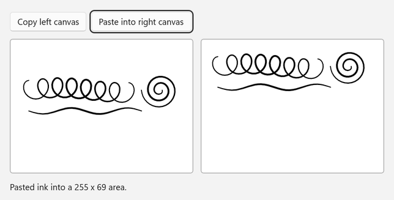
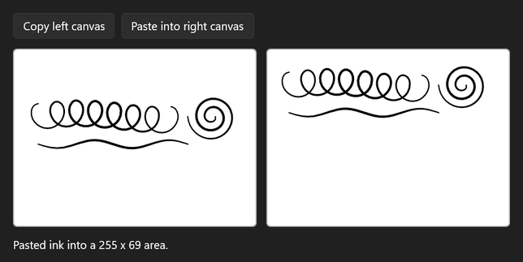

<!-- Copyright (c) Microsoft Corporation. All rights reserved. -->
<!-- Licensed under the MIT License. -->

# Copy ink between canvases with the clipboard

`InkStrokeContainer` has built-in clipboard support. `CopySelectedToClipboard` copies the selected strokes, `CanPasteFromClipboard` checks whether the clipboard holds ink, and `PasteFromClipboard` drops it at a point you choose. Here, ink drawn on the left canvas is pasted into the right one.

| Light | Dark |
|---|---|
|  |  |

## Use it

1. Paste the XAML inside your page's root `Grid` (or any panel).
2. Add the `using` directives to the top of the code-behind file.
3. Paste the members into the page class and call `InitializeInking();` right after `InitializeComponent();` in the constructor.

### XAML

```xml
<StackPanel Spacing="12">
    <StackPanel Orientation="Horizontal" Spacing="8">
        <Button Click="CopyButton_Click" Content="Copy left canvas" />
        <Button x:Name="PasteButton" Click="PasteButton_Click" Content="Paste into right canvas" IsEnabled="False" />
    </StackPanel>
    <StackPanel Orientation="Horizontal" Spacing="12">
        <Border
            Width="300"
            Height="220"
            Background="White"
            BorderBrush="#FFB4B4B4"
            BorderThickness="1"
            CornerRadius="4">
            <InkCanvas x:Name="SourceSurface" AutomationProperties.Name="Source drawing surface" />
        </Border>
        <Border
            Width="300"
            Height="220"
            Background="White"
            BorderBrush="#FFB4B4B4"
            BorderThickness="1"
            CornerRadius="4">
            <InkCanvas x:Name="TargetSurface" AutomationProperties.Name="Target drawing surface" />
        </Border>
    </StackPanel>
    <TextBlock x:Name="StatusText" Text="Draw on the left canvas, then copy it." TextWrapping="Wrap" />
</StackPanel>
```

### Usings

```csharp
using System.Collections.Generic;
using Microsoft.UI.Xaml;
using Microsoft.UI.Xaml.Controls;
using Windows.Foundation;
using Windows.UI.Core;
using InkStroke = Windows.UI.Input.Inking.InkStroke;
```

### Code-behind

```csharp
private void InitializeInking()
{
    foreach (InkCanvas canvas in new[] { SourceSurface, TargetSurface })
    {
        canvas.InkPresenter.InputDeviceTypes |= CoreInputDeviceTypes.Mouse | CoreInputDeviceTypes.Touch;
    }
}

private void CopyButton_Click(object sender, RoutedEventArgs e)
{
    InkStrokeContainer source = SourceSurface.InkPresenter.StrokeContainer;
    IReadOnlyList<InkStroke> strokes = source.GetStrokes();
    if (strokes.Count == 0)
    {
        StatusText.Text = "Draw on the left canvas first.";
        return;
    }

    // Only selected strokes are copied, so select them all, copy, then clear the selection again.
    foreach (InkStroke stroke in strokes)
    {
        stroke.Selected = true;
    }

    source.CopySelectedToClipboard();

    foreach (InkStroke stroke in strokes)
    {
        stroke.Selected = false;
    }

    PasteButton.IsEnabled = TargetSurface.InkPresenter.StrokeContainer.CanPasteFromClipboard();
    StatusText.Text = $"Copied {strokes.Count} stroke(s) to the clipboard.";
}

private void PasteButton_Click(object sender, RoutedEventArgs e)
{
    InkStrokeContainer target = TargetSurface.InkPresenter.StrokeContainer;
    if (!target.CanPasteFromClipboard())
    {
        StatusText.Text = "The clipboard doesn't contain ink.";
        return;
    }

    // The point is where the top-left corner of the pasted ink lands, in DIPs.
    Rect pasted = target.PasteFromClipboard(new Point(16, 16));
    StatusText.Text = $"Pasted ink into a {pasted.Width:0} x {pasted.Height:0} area.";
}
```

## How it works

- Ink goes onto the system clipboard as ink data, and `CanPasteFromClipboard` tells you whether there's ink to paste.
- `PasteFromClipboard` returns the bounds of the pasted strokes. Use it to scroll to or select the new ink.
- The pasted strokes keep their colors and sizes because the drawing attributes travel with the ink.
