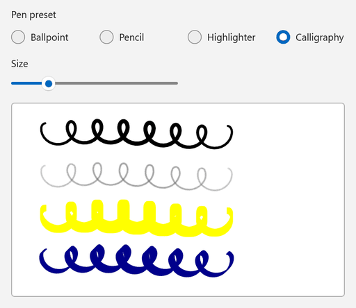
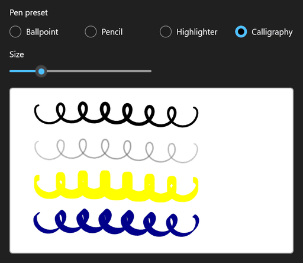

<!-- Copyright (c) Microsoft Corporation. All rights reserved. -->
<!-- Licensed under the MIT License. -->

# Pen presets with InkDrawingAttributes

Switch the default ink between ballpoint, pencil, highlighter and a calligraphy nib. All of it goes through `InkDrawingAttributes`, which is applied with `InkPresenter.UpdateDefaultDrawingAttributes`.

| Light | Dark |
|---|---|
|  |  |

## Use it

1. Paste the XAML inside your page's root `Grid` (or any panel).
2. Add the `using` directives to the top of the code-behind file.
3. Paste the members into the page class and call `InitializeInking();` right after `InitializeComponent();` in the constructor.

### XAML

```xml
<StackPanel Spacing="12">
    <RadioButtons
        x:Name="PresetButtons"
        Header="Pen preset"
        MaxColumns="4"
        SelectedIndex="0"
        SelectionChanged="PresetButtons_SelectionChanged">
        <x:String>Ballpoint</x:String>
        <x:String>Pencil</x:String>
        <x:String>Highlighter</x:String>
        <x:String>Calligraphy</x:String>
    </RadioButtons>
    <Slider
        x:Name="SizeSlider"
        Width="240"
        HorizontalAlignment="Left"
        Header="Size"
        Maximum="16"
        Minimum="1"
        Value="4"
        ValueChanged="SizeSlider_ValueChanged" />
    <Border
        Width="480"
        Height="280"
        HorizontalAlignment="Left"
        Background="White"
        BorderBrush="#FFB4B4B4"
        BorderThickness="1"
        CornerRadius="4">
        <InkCanvas x:Name="InkSurface" AutomationProperties.Name="Drawing surface" />
    </Border>
</StackPanel>
```

### Usings

```csharp
using System;
using System.Numerics;
using Microsoft.UI;
using Microsoft.UI.Xaml.Controls;
using Microsoft.UI.Xaml.Controls.Primitives;
using Windows.Foundation;
using Windows.UI.Core;
using InkDrawingAttributes = Windows.UI.Input.Inking.InkDrawingAttributes;
using PenTipShape = Windows.UI.Input.Inking.PenTipShape;
```

### Code-behind

```csharp
private void InitializeInking()
{
    InkSurface.InkPresenter.InputDeviceTypes |= CoreInputDeviceTypes.Mouse | CoreInputDeviceTypes.Touch;
    ApplyPreset();
}

private void PresetButtons_SelectionChanged(object sender, SelectionChangedEventArgs e) => ApplyPreset();

private void SizeSlider_ValueChanged(object sender, RangeBaseValueChangedEventArgs e) => ApplyPreset();

private void ApplyPreset()
{
    // SelectionChanged and ValueChanged can fire while the XAML is still loading.
    if (InkSurface is null || PresetButtons is null || SizeSlider is null)
    {
        return;
    }

    double size = SizeSlider.Value;
    InkDrawingAttributes attributes;

    switch (PresetButtons.SelectedItem as string)
    {
        case "Pencil":
            // CreateForPencil returns attributes whose Kind is Pencil: textured, pressure-shaded graphite.
            attributes = InkDrawingAttributes.CreateForPencil();
            attributes.Color = Colors.DimGray;
            attributes.Size = new Size(size, size);
            break;

        case "Highlighter":
            attributes = new InkDrawingAttributes
            {
                Color = Colors.Yellow,
                DrawAsHighlighter = true,
                PenTip = PenTipShape.Rectangle,
                Size = new Size(size, size * 3),
            };
            break;

        case "Calligraphy":
            attributes = new InkDrawingAttributes
            {
                Color = Colors.DarkBlue,
                PenTip = PenTipShape.Rectangle,
                Size = new Size(Math.Max(1, size / 2), size * 2),
                // Turn the nib 45 degrees so the stroke width changes with its direction.
                PenTipTransform = Matrix3x2.CreateRotation(MathF.PI / 4),
            };
            break;

        default:
            attributes = new InkDrawingAttributes
            {
                Color = Colors.Black,
                PenTip = PenTipShape.Circle,
                Size = new Size(size, size),
            };
            break;
    }

    InkSurface.InkPresenter.UpdateDefaultDrawingAttributes(attributes);
}
```

## How it works

- `InkDrawingAttributes` is the UWP type (`Windows.UI.Input.Inking`), used unchanged. The alias keeps it clear of the `Ink*` types that are also declared in `Microsoft.UI.Xaml.Controls`.
- `UpdateDefaultDrawingAttributes` affects strokes drawn **after** the call. Strokes already on the canvas keep their own attributes.
- To tweak only one property, call `CopyDefaultDrawingAttributes()`, change the copy and pass it back. `Kind` is read-only, so create a new object when you switch pen kinds.
- `PenTipTransform` is what produces the thick and thin calligraphy strokes: the rotated rectangle nib is wide in one direction and narrow in the other.

## Known limitations (Windows App SDK 2.4.1-experimental)

- `InkCanvas` is an experimental API, so the compiler reports `CS8305` until you suppress it.
