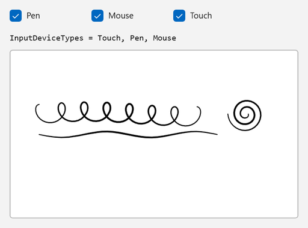
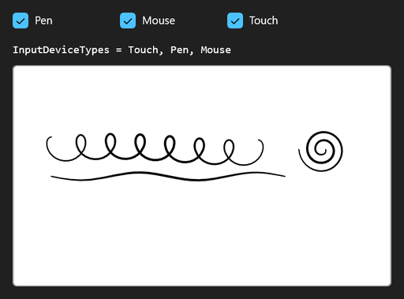

<!-- Copyright (c) Microsoft Corporation. All rights reserved. -->
<!-- Licensed under the MIT License. -->

# Choose which devices can ink

**Mouse input is off by default** on a new `InkCanvas`. `InkPresenter.InputDeviceTypes` is a flags mask, so you can add or remove pen, mouse and touch one at a time without restating the others.

| Light | Dark |
|---|---|
|  |  |

## Use it

1. Paste the XAML inside your page's root `Grid` (or any panel).
2. Add the `using` directives to the top of the code-behind file.
3. Paste the members into the page class and call `InitializeInking();` right after `InitializeComponent();` in the constructor.

### XAML

```xml
<StackPanel Spacing="12">
    <StackPanel Orientation="Horizontal" Spacing="16">
        <CheckBox x:Name="PenBox" Content="Pen" Tag="Pen" Click="DeviceBox_Click" />
        <CheckBox x:Name="MouseBox" Content="Mouse" Tag="Mouse" Click="DeviceBox_Click" />
        <CheckBox x:Name="TouchBox" Content="Touch" Tag="Touch" Click="DeviceBox_Click" />
    </StackPanel>
    <TextBlock x:Name="DeviceMaskText" FontFamily="Consolas" />
    <Border
        Width="480"
        Height="280"
        HorizontalAlignment="Left"
        Background="White"
        BorderBrush="#FFB4B4B4"
        BorderThickness="1"
        CornerRadius="4">
        <InkCanvas x:Name="InkSurface" AutomationProperties.Name="Drawing surface" />
    </Border>
</StackPanel>
```

### Usings

```csharp
using System;
using Microsoft.UI.Xaml;
using Microsoft.UI.Xaml.Controls;
using Windows.UI.Core;
```

### Code-behind

```csharp
private void InitializeInking()
{
    // Mouse is off by default. Add it so the sample also works without a pen or touch screen.
    InkSurface.InkPresenter.InputDeviceTypes |= CoreInputDeviceTypes.Mouse;
    ShowDeviceTypes();
}

private void DeviceBox_Click(object sender, RoutedEventArgs e)
{
    if (sender is CheckBox { Tag: string deviceName } box)
    {
        CoreInputDeviceTypes device = Enum.Parse<CoreInputDeviceTypes>(deviceName);

        // Add or remove a single device and leave the other flags alone.
        if (box.IsChecked == true)
        {
            InkSurface.InkPresenter.InputDeviceTypes |= device;
        }
        else
        {
            InkSurface.InkPresenter.InputDeviceTypes &= ~device;
        }
    }

    ShowDeviceTypes();
}

private void ShowDeviceTypes()
{
    CoreInputDeviceTypes current = InkSurface.InkPresenter.InputDeviceTypes;
    PenBox.IsChecked = current.HasFlag(CoreInputDeviceTypes.Pen);
    MouseBox.IsChecked = current.HasFlag(CoreInputDeviceTypes.Mouse);
    TouchBox.IsChecked = current.HasFlag(CoreInputDeviceTypes.Touch);
    DeviceMaskText.Text = $"InputDeviceTypes = {current}";
}
```

## How it works

- `InputDeviceTypes` is a `Windows.UI.Core.CoreInputDeviceTypes` value, the same type UWP uses.
- `|=` adds a device and `&= ~` removes one. Either way the rest of the mask is untouched.
- The check boxes are read back from the mask rather than trusted, so the UI always shows what the presenter really has.
- If you clear every device, the canvas stops inking until you add one back.

## Known limitations (Windows App SDK 2.4.1-experimental)

- The default mask is `Pen, Touch`. It may become pen-only (as in UWP) in a later release, so if your app relies on touch inking, add `Touch` explicitly instead of counting on the default.
- `InkCanvas` is an experimental API, so the compiler reports `CS8305` until you suppress it (`<NoWarn>$(NoWarn);CS8305</NoWarn>`).
