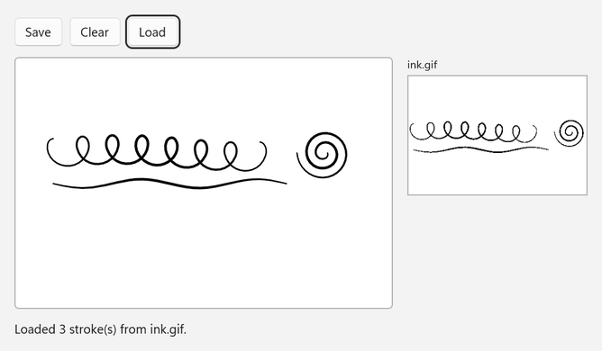
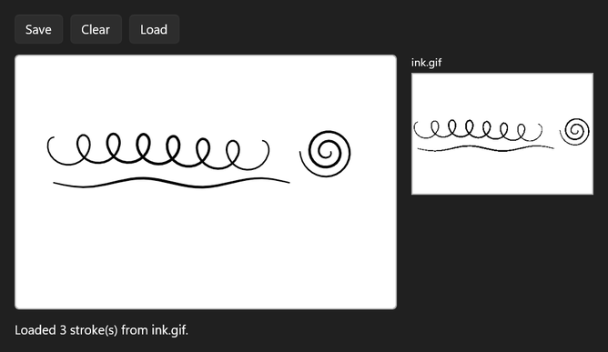

<!-- Copyright (c) Microsoft Corporation. All rights reserved. -->
<!-- Licensed under the MIT License. -->

# Save ink as a GIF with embedded ISF

`InkStrokeContainer.SaveAsync` can write `InkPersistenceFormat.GifWithEmbeddedIsf`. The result is an ordinary GIF that any image viewer can open, and it also carries the full Ink Serialized Format data, so `LoadAsync` gets back editable strokes. The sample shows the saved file as an image next to the canvas.

| Light | Dark |
|---|---|
|  |  |

## Use it

1. Paste the XAML inside your page's root `Grid` (or any panel).
2. Add the `using` directives to the top of the code-behind file.
3. Paste the members into the page class and call `InitializeInking();` right after `InitializeComponent();` in the constructor.

The file goes to `ApplicationData.Current.LocalFolder`, which needs package identity (the default for new WinUI 3 apps). Unpackaged apps can use any `StorageFolder` or a file path instead.

### XAML

```xml
<StackPanel Spacing="12">
    <StackPanel Orientation="Horizontal" Spacing="8">
        <Button Click="SaveButton_Click" Content="Save" />
        <Button Click="ClearButton_Click" Content="Clear" />
        <Button x:Name="LoadButton" Click="LoadButton_Click" Content="Load" IsEnabled="False" />
    </StackPanel>
    <StackPanel Orientation="Horizontal" Spacing="16">
        <Border
            Width="420"
            Height="280"
            Background="White"
            BorderBrush="#FFB4B4B4"
            BorderThickness="1"
            CornerRadius="4">
            <InkCanvas x:Name="InkSurface" AutomationProperties.Name="Drawing surface" />
        </Border>
        <StackPanel Spacing="4">
            <TextBlock Style="{ThemeResource CaptionTextBlockStyle}" Text="ink.gif" />
            <Border
                Width="200"
                Height="134"
                Background="White"
                BorderBrush="#FFB4B4B4"
                BorderThickness="1">
                <Image x:Name="PreviewImage" AutomationProperties.Name="Saved ink preview" Stretch="Uniform" />
            </Border>
        </StackPanel>
    </StackPanel>
    <TextBlock x:Name="StatusText" Text="Draw something, then select Save." TextWrapping="Wrap" />
</StackPanel>
```

### Usings

```csharp
using System;
using Microsoft.UI.Xaml;
using Microsoft.UI.Xaml.Controls;
using Microsoft.UI.Xaml.Media.Imaging;
using Windows.Storage;
using Windows.Storage.FileProperties;
using Windows.Storage.Streams;
using Windows.UI.Core;
using InkPersistenceFormat = Windows.UI.Input.Inking.InkPersistenceFormat;
```

### Code-behind

```csharp
private const string InkFileName = "ink.gif";

private void InitializeInking()
{
    InkSurface.InkPresenter.InputDeviceTypes |= CoreInputDeviceTypes.Mouse | CoreInputDeviceTypes.Touch;
}

private async void SaveButton_Click(object sender, RoutedEventArgs e)
{
    InkStrokeContainer container = InkSurface.InkPresenter.StrokeContainer;
    int strokeCount = container.GetStrokes().Count;
    if (strokeCount == 0)
    {
        StatusText.Text = "There is no ink to save yet.";
        return;
    }

    StorageFile file = await ApplicationData.Current.LocalFolder.CreateFileAsync(
        InkFileName, CreationCollisionOption.ReplaceExisting);

    using (IRandomAccessStream stream = await file.OpenAsync(FileAccessMode.ReadWrite))
    using (IOutputStream output = stream.GetOutputStreamAt(0))
    {
        // A regular GIF image that also carries the full, editable ink data.
        await container.SaveAsync(output, InkPersistenceFormat.GifWithEmbeddedIsf);
        await output.FlushAsync();
    }

    BasicProperties properties = await file.GetBasicPropertiesAsync();
    StatusText.Text = $"Saved {strokeCount} stroke(s) ({properties.Size:N0} bytes) to {file.Name} in the app's local folder.";
    LoadButton.IsEnabled = true;

    using IRandomAccessStream imageStream = await file.OpenReadAsync();
    BitmapImage preview = new();
    await preview.SetSourceAsync(imageStream);
    PreviewImage.Source = preview;
}

private void ClearButton_Click(object sender, RoutedEventArgs e)
{
    InkSurface.InkPresenter.StrokeContainer.Clear();
    StatusText.Text = "Canvas cleared. Select Load to bring the saved ink back.";
}

private async void LoadButton_Click(object sender, RoutedEventArgs e)
{
    StorageFile file = await ApplicationData.Current.LocalFolder.GetFileAsync(InkFileName);

    using (IRandomAccessStream stream = await file.OpenReadAsync())
    using (IInputStream input = stream.GetInputStreamAt(0))
    {
        // LoadAsync replaces whatever is on the canvas with the strokes in the file.
        await InkSurface.InkPresenter.StrokeContainer.LoadAsync(input);
    }

    int strokeCount = InkSurface.InkPresenter.StrokeContainer.GetStrokes().Count;
    StatusText.Text = $"Loaded {strokeCount} stroke(s) from {InkFileName}.";
}
```

## How it works

- `InkStrokeContainer` here is the WinUI type from `Microsoft.UI.Xaml.Controls`. `InkPersistenceFormat` is the UWP enum, aliased so the two namespaces don't collide.
- `SaveAsync(stream)` without a format writes plain ISF. `GifWithEmbeddedIsf` costs a few more bytes and gives you a file people can open anywhere.
- Loaded strokes come back with their original color, size, pen tip and pressure, and they stay fully editable.
- Save and load are real async I/O. Other `InkStrokeContainer` calls made while one is running wait for it to finish.

## Known limitations (Windows App SDK 2.4.1-experimental)

- Rendering the canvas to a bitmap with `RenderTargetBitmap` doesn't capture ink yet. Saving as `GifWithEmbeddedIsf` is the way to get an image of the ink.
