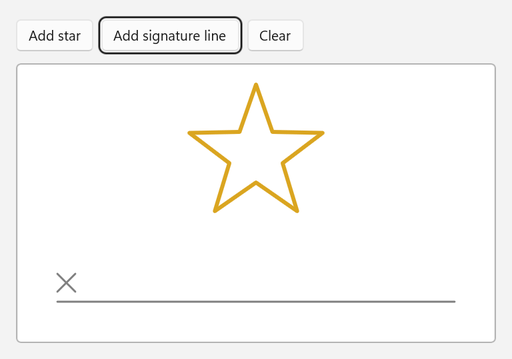
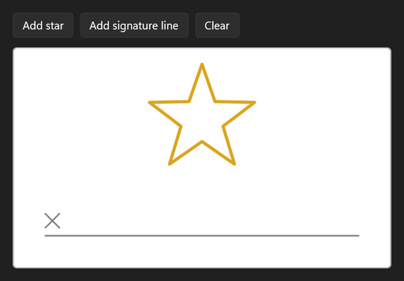

<!-- Copyright (c) Microsoft Corporation. All rights reserved. -->
<!-- Licensed under the MIT License. -->

# Create strokes in code with InkStrokeBuilder

`InkStrokeBuilder` turns a list of points into a real `InkStroke`. You can add that stroke to any canvas, where it behaves like hand-drawn ink: it can be selected, erased, saved and undone. This sample builds a star and a signature line in code and then lets you sign on the line.

| Light | Dark |
|---|---|
|  |  |

## Use it

1. Paste the XAML inside your page's root `Grid` (or any panel).
2. Add the `using` directives to the top of the code-behind file.
3. Paste the members into the page class and call `InitializeInking();` right after `InitializeComponent();` in the constructor.

### XAML

```xml
<StackPanel Spacing="12">
    <StackPanel Orientation="Horizontal" Spacing="8">
        <Button Click="AddStarButton_Click" Content="Add star" />
        <Button Click="AddSignatureLineButton_Click" Content="Add signature line" />
        <Button Click="ClearButton_Click" Content="Clear" />
    </StackPanel>
    <Border
        Width="480"
        Height="280"
        HorizontalAlignment="Left"
        Background="White"
        BorderBrush="#FFB4B4B4"
        BorderThickness="1"
        CornerRadius="4">
        <InkCanvas x:Name="InkSurface" AutomationProperties.Name="Drawing surface" />
    </Border>
</StackPanel>
```

### Usings

```csharp
using System;
using System.Collections.Generic;
using Microsoft.UI;
using Microsoft.UI.Xaml;
using Windows.Foundation;
using Windows.UI;
using Windows.UI.Core;
using InkDrawingAttributes = Windows.UI.Input.Inking.InkDrawingAttributes;
using InkStroke = Windows.UI.Input.Inking.InkStroke;
using InkStrokeBuilder = Windows.UI.Input.Inking.InkStrokeBuilder;
```

### Code-behind

```csharp
private void InitializeInking()
{
    InkSurface.InkPresenter.InputDeviceTypes |= CoreInputDeviceTypes.Mouse | CoreInputDeviceTypes.Touch;
}

private void AddStarButton_Click(object sender, RoutedEventArgs e)
{
    // A five-pointed star in the upper part of the canvas: alternate outer and inner points.
    Point center = new(InkSurface.ActualWidth / 2, 90);
    List<Point> points = new();
    for (int i = 0; i <= 10; i++)
    {
        double radius = i % 2 == 0 ? 70 : 28;
        double angle = -Math.PI / 2 + i * Math.PI / 5;
        points.Add(new Point(center.X + radius * Math.Cos(angle), center.Y + radius * Math.Sin(angle)));
    }

    AddStroke(points, Colors.Goldenrod, 4);
}

private void AddSignatureLineButton_Click(object sender, RoutedEventArgs e)
{
    double left = 40;
    double right = InkSurface.ActualWidth - 40;
    double baseline = InkSurface.ActualHeight - 40;

    AddStroke(new[] { new Point(left, baseline), new Point(right, baseline) }, Colors.Gray, 2);
    AddStroke(new[] { new Point(left, baseline - 28), new Point(left + 18, baseline - 10) }, Colors.Gray, 2);
    AddStroke(new[] { new Point(left + 18, baseline - 28), new Point(left, baseline - 10) }, Colors.Gray, 2);
}

private void ClearButton_Click(object sender, RoutedEventArgs e)
{
    InkSurface.InkPresenter.StrokeContainer.Clear();
}

private void AddStroke(IEnumerable<Point> points, Color color, double size)
{
    InkStrokeBuilder builder = new();
    builder.SetDefaultDrawingAttributes(new InkDrawingAttributes
    {
        Color = color,
        Size = new Size(size, size),
        // Keep straight segments and sharp corners instead of smoothing them into curves.
        FitToCurve = false,
    });

    InkStroke stroke = builder.CreateStroke(points);
    InkSurface.InkPresenter.StrokeContainer.AddStroke(stroke);
}
```

## How it works

- `InkStrokeBuilder` and `InkStroke` are the UWP types, reused unchanged. Strokes built in code and hand-drawn strokes are the same kind of object.
- Points are in the canvas's DIPs, the same coordinates as XAML layout, so `ActualWidth` and `ActualHeight` can be used directly.
- `FitToCurve = false` keeps the points exactly as given, which is what you want for lines and shapes. Leave it at the default (`true`) for smooth, handwriting-like strokes.
- A stroke can only be added to one container. Call `Clone()` if you want the same stroke on a second canvas.
