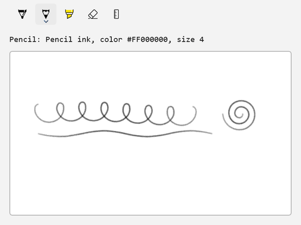
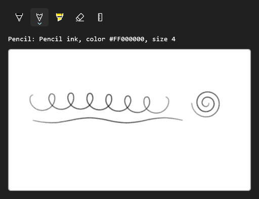

<!-- Copyright (c) Microsoft Corporation. All rights reserved. -->
<!-- Licensed under the MIT License. -->

# Start on a tool and follow tool changes

Once the toolbar has loaded, `GetToolButton` returns a built-in tool button and assigning it to `ActiveTool` selects it. This sample starts on the pencil. `ActiveToolChanged` and `InkDrawingAttributesChanged` then drive a live readout of the tool, ink kind, color and size.

| Light | Dark |
|---|---|
|  |  |

## Use it

1. Paste the XAML inside your page's root `Grid` (or any panel).
2. Add the `using` directives to the top of the code-behind file.
3. Paste the members into the page class and call `InitializeInking();` right after `InitializeComponent();` in the constructor.

### XAML

```xml
<StackPanel Spacing="12">
    <InkToolbar x:Name="InkTools" AutomationProperties.Name="Ink tools" TargetInkCanvas="{x:Bind InkSurface}" />
    <TextBlock x:Name="ToolInfo" FontFamily="Consolas" />
    <Border
        Width="480"
        Height="280"
        HorizontalAlignment="Left"
        Background="White"
        BorderBrush="#FFB4B4B4"
        BorderThickness="1"
        CornerRadius="4">
        <InkCanvas x:Name="InkSurface" AutomationProperties.Name="Drawing surface" />
    </Border>
</StackPanel>
```

### Usings

```csharp
using Microsoft.UI.Xaml.Controls;
using Windows.UI.Core;
```

### Code-behind

```csharp
private void InitializeInking()
{
    InkSurface.InkPresenter.InputDeviceTypes |= CoreInputDeviceTypes.Mouse | CoreInputDeviceTypes.Touch;

    InkTools.ActiveToolChanged += (sender, args) => ShowToolInfo();
    InkTools.InkDrawingAttributesChanged += (sender, args) => ShowToolInfo();

    // The built-in buttons are created when the toolbar loads, so pick the starting tool then.
    InkTools.Loaded += (sender, args) =>
    {
        InkTools.ActiveTool = InkTools.GetToolButton(InkToolbarTool.Pencil);
        ShowToolInfo();
    };
}

private void ShowToolInfo()
{
    if (InkTools.ActiveTool is not { } tool)
    {
        ToolInfo.Text = "No active tool";
        return;
    }

    ToolInfo.Text = InkTools.InkDrawingAttributes is { } attributes
        ? $"{tool.ToolKind}: {attributes.Kind} ink, color {attributes.Color}, size {attributes.Size.Width:0}"
        : $"{tool.ToolKind}";
}
```

## How it works

- The built-in tool buttons are created as part of the toolbar's own setup, so this sample waits for `Loaded` before calling `GetToolButton` and setting `ActiveTool`.
- `ActiveToolChanged` fires when the user or your code changes the tool. `InkDrawingAttributesChanged` fires when the color or size of the current pen changes.
- `InkDrawingAttributes.Kind` shows the pencil's distinct `Pencil` ink kind, compared with `Default` for the ballpoint pen and highlighter.
- `tool.ToolKind` is an `InkToolbarTool`, which is handy for saving the user's last tool and restoring it with `GetToolButton`.
