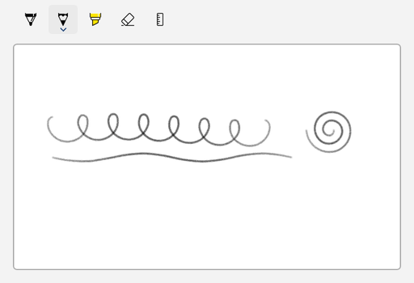
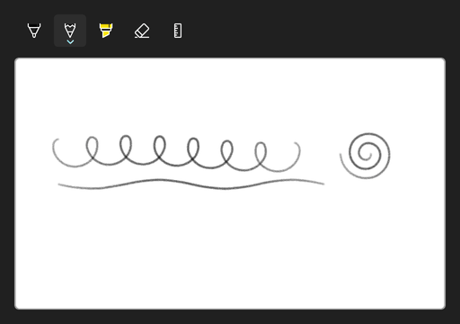

<!-- Copyright (c) Microsoft Corporation. All rights reserved. -->
<!-- Licensed under the MIT License. -->

# Build the toolbar and canvas in code

Everything that works in XAML also works from C#. This sample builds the toolbar, a white canvas frame and the `InkCanvas` in code, links them with `TargetInkCanvas`, selects the pencil once the toolbar has loaded, and puts the result in a placeholder `Border`.

| Light | Dark |
|---|---|
|  |  |

## Use it

1. Paste the XAML inside your page's root `Grid` (or any panel).
2. Add the `using` directives to the top of the code-behind file.
3. Paste the members into the page class and call `InitializeInking();` right after `InitializeComponent();` in the constructor.

### XAML

```xml
<Border x:Name="InkHost" HorizontalAlignment="Left" />
```

### Usings

```csharp
using Microsoft.UI;
using Microsoft.UI.Xaml;
using Microsoft.UI.Xaml.Automation;
using Microsoft.UI.Xaml.Controls;
using Microsoft.UI.Xaml.Media;
using Windows.UI.Core;
```

### Code-behind

```csharp
private void InitializeInking()
{
    InkCanvas canvas = new();
    AutomationProperties.SetName(canvas, "Drawing surface");
    canvas.InkPresenter.InputDeviceTypes |= CoreInputDeviceTypes.Mouse | CoreInputDeviceTypes.Touch;

    InkToolbar toolbar = new() { TargetInkCanvas = canvas };
    AutomationProperties.SetName(toolbar, "Ink tools");

    // Built-in tool buttons exist only after the toolbar loads.
    toolbar.Loaded += (sender, args) => toolbar.ActiveTool = toolbar.GetToolButton(InkToolbarTool.Pencil);

    Border canvasFrame = new()
    {
        Width = 480,
        Height = 280,
        Background = new SolidColorBrush(Colors.White),
        BorderBrush = new SolidColorBrush(Colors.DarkGray),
        BorderThickness = new Thickness(1),
        CornerRadius = new CornerRadius(4),
        Child = canvas,
    };

    Grid layout = new() { RowSpacing = 8 };
    layout.RowDefinitions.Add(new RowDefinition { Height = GridLength.Auto });
    layout.RowDefinitions.Add(new RowDefinition { Height = GridLength.Auto });
    Grid.SetRow(toolbar, 0);
    Grid.SetRow(canvasFrame, 1);
    layout.Children.Add(toolbar);
    layout.Children.Add(canvasFrame);

    InkHost.Child = layout;
}
```

## How it works

- `new InkCanvas()` creates its `InkPresenter` straight away, so input devices and drawing attributes can be set before the canvas is in the tree.
- `TargetInkCanvas` is set here before either element is in the tree. The toolbar starts driving the canvas once both are loaded.
- The C++/WinRT version has the same shape: `InkToolbar toolbar{}; toolbar.TargetInkCanvas(canvas); toolbar.ActiveTool(toolbar.GetToolButton(InkToolbarTool::Pencil));`.
