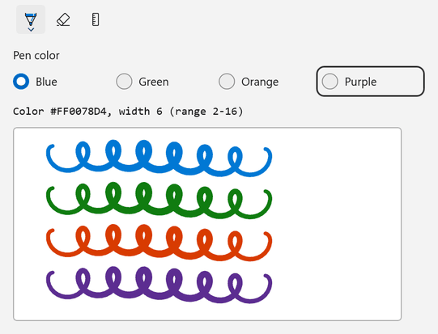
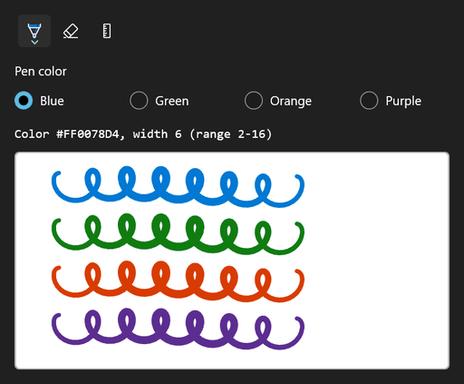

<!-- Copyright (c) Microsoft Corporation. All rights reserved. -->
<!-- Licensed under the MIT License. -->

# Give a pen your own color palette and stroke widths

Replace the toolbar's default pens with an `InkToolbarBallpointPenButton` that has a limited stroke-width range (`MinStrokeWidth` / `MaxStrokeWidth`), a starting width and, set from code, a custom `Palette`. `SelectedBrushIndex` can also be set from code, which this sample uses for a row of color chips under the toolbar.

| Light | Dark |
|---|---|
|  |  |

## Use it

1. Paste the XAML inside your page's root `Grid` (or any panel).
2. Add the `using` directives to the top of the code-behind file.
3. Paste the members into the page class and call `InitializeInking();` right after `InitializeComponent();` in the constructor.

### XAML

```xml
<StackPanel Spacing="12">
    <InkToolbar
        x:Name="InkTools"
        AutomationProperties.Name="Ink tools"
        InitialControls="AllExceptPens"
        TargetInkCanvas="{x:Bind InkSurface}">
        <InkToolbarBallpointPenButton
            x:Name="BrandPen"
            AutomationProperties.Name="Brand pen"
            MaxStrokeWidth="16"
            MinStrokeWidth="2"
            SelectedStrokeWidth="6" />
    </InkToolbar>
    <RadioButtons
        x:Name="ColorChips"
        Header="Pen color"
        MaxColumns="4"
        SelectedIndex="0"
        SelectionChanged="ColorChips_SelectionChanged">
        <x:String>Blue</x:String>
        <x:String>Green</x:String>
        <x:String>Orange</x:String>
        <x:String>Purple</x:String>
    </RadioButtons>
    <TextBlock x:Name="PenInfo" FontFamily="Consolas" />
    <Border
        Width="480"
        Height="240"
        HorizontalAlignment="Left"
        Background="White"
        BorderBrush="#FFB4B4B4"
        BorderThickness="1"
        CornerRadius="4">
        <InkCanvas x:Name="InkSurface" AutomationProperties.Name="Drawing surface" />
    </Border>
</StackPanel>
```

### Usings

```csharp
using System.Collections.Generic;
using System.Linq;
using Microsoft.UI.Xaml.Controls;
using Microsoft.UI.Xaml.Media;
using Windows.UI;
using Windows.UI.Core;
```

### Code-behind

```csharp
private static readonly Color[] BrandColors =
{
    Color.FromArgb(0xFF, 0x00, 0x78, 0xD4), // Blue
    Color.FromArgb(0xFF, 0x10, 0x7C, 0x10), // Green
    Color.FromArgb(0xFF, 0xD8, 0x3B, 0x01), // Orange
    Color.FromArgb(0xFF, 0x5C, 0x2D, 0x91), // Purple
};

private void InitializeInking()
{
    InkSurface.InkPresenter.InputDeviceTypes |= CoreInputDeviceTypes.Mouse | CoreInputDeviceTypes.Touch;

    // Replace the pen's palette, then pick its first entry.
    BrandPen.Palette = BrandColors.Select(color => (Brush)new SolidColorBrush(color)).ToList();
    BrandPen.SelectedBrushIndex = 0;

    InkTools.InkDrawingAttributesChanged += (sender, args) => ShowPenInfo();
    InkTools.Loaded += (sender, args) =>
    {
        // Start with the custom pen selected and its first palette color applied.
        InkTools.ActiveTool = BrandPen;
        ShowPenInfo();
    };
}

private void ColorChips_SelectionChanged(object sender, SelectionChangedEventArgs e)
{
    if (BrandPen is not null && ColorChips.SelectedIndex >= 0)
    {
        // SelectedBrushIndex picks an entry from Palette, just like choosing a swatch in the pen flyout.
        BrandPen.SelectedBrushIndex = ColorChips.SelectedIndex;
        InkTools.ActiveTool = BrandPen;
        ShowPenInfo();
    }
}

private void ShowPenInfo()
{
    if (InkTools.InkDrawingAttributes is { } attributes)
    {
        PenInfo.Text = $"Color {attributes.Color}, width {attributes.Size.Width:0} (range {BrandPen.MinStrokeWidth:0}-{BrandPen.MaxStrokeWidth:0})";
    }
}
```

## How it works

- With `InitialControls="AllExceptPens"` the toolbar still creates the eraser and stencil buttons, and your own pen buttons take the place of the defaults.
- `Palette` is an `IList<Brush>`. Assign a new list from code; only the color of a `SolidColorBrush` is used for ink.
- `MinStrokeWidth` and `MaxStrokeWidth` set the range the user can pick from. Keep `SelectedStrokeWidth` inside it.
- `InkToolbar.InkDrawingAttributes` always reflects the active tool, so reading it in `InkDrawingAttributesChanged` tells you what the next stroke will look like.

## Known limitations (Windows App SDK 2.4.1-experimental)

- Filling `Palette` in XAML (`<InkToolbarBallpointPenButton.Palette>` with brushes inside) fails with a XAML parse error, so set it from code as shown.
