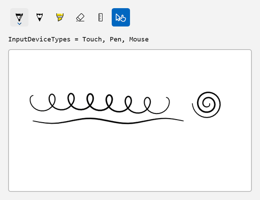
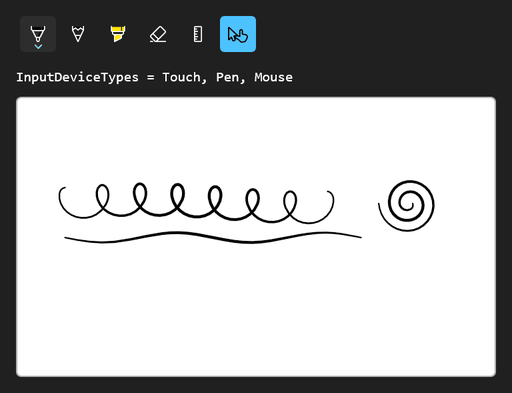

<!-- Copyright (c) Microsoft Corporation. All rights reserved. -->
<!-- Licensed under the MIT License. -->

# Add a custom toggle for touch writing

`InkToolbarCustomToggleButton` adds an on/off button of your own to the toolbar. The classic use is a "touch writing" switch: pen and mouse always ink, and touch only inks while the toggle is on, so a finger can scroll the page the rest of the time.

| Light | Dark |
|---|---|
|  |  |

## Use it

1. Paste the XAML inside your page's root `Grid` (or any panel).
2. Add the `using` directives to the top of the code-behind file.
3. Paste the members into the page class and call `InitializeInking();` right after `InitializeComponent();` in the constructor.

### XAML

```xml
<StackPanel Spacing="12">
    <InkToolbar AutomationProperties.Name="Ink tools" TargetInkCanvas="{x:Bind InkSurface}">
        <InkToolbarCustomToggleButton
            x:Name="TouchWritingToggle"
            AutomationProperties.Name="Touch writing"
            Checked="TouchWritingToggle_Changed"
            ToolTipService.ToolTip="Touch writing"
            Unchecked="TouchWritingToggle_Changed">
            <SymbolIcon Symbol="TouchPointer" />
        </InkToolbarCustomToggleButton>
    </InkToolbar>
    <TextBlock x:Name="DeviceInfo" FontFamily="Consolas" />
    <Border
        Width="480"
        Height="280"
        HorizontalAlignment="Left"
        Background="White"
        BorderBrush="#FFB4B4B4"
        BorderThickness="1"
        CornerRadius="4">
        <InkCanvas x:Name="InkSurface" AutomationProperties.Name="Drawing surface" />
    </Border>
</StackPanel>
```

### Usings

```csharp
using Microsoft.UI.Xaml;
using Windows.UI.Core;
```

### Code-behind

```csharp
private void InitializeInking()
{
    // Pen and mouse always ink. Touch is controlled by the custom toggle.
    InkSurface.InkPresenter.InputDeviceTypes = CoreInputDeviceTypes.Pen | CoreInputDeviceTypes.Mouse;
    ShowDevices();
}

private void TouchWritingToggle_Changed(object sender, RoutedEventArgs e)
{
    if (TouchWritingToggle.IsChecked == true)
    {
        InkSurface.InkPresenter.InputDeviceTypes |= CoreInputDeviceTypes.Touch;
    }
    else
    {
        InkSurface.InkPresenter.InputDeviceTypes &= ~CoreInputDeviceTypes.Touch;
    }

    ShowDevices();
}

private void ShowDevices()
{
    DeviceInfo.Text = $"InputDeviceTypes = {InkSurface.InkPresenter.InputDeviceTypes}";
}
```

## How it works

- `InkToolbarCustomToggleButton` is a `CheckBox` underneath, so you get `IsChecked`, `Checked` and `Unchecked`, plus keyboard and screen-reader support, without extra work.
- Its content is the icon shown on the toolbar. Set `AutomationProperties.Name` and a tooltip so the icon-only button has a name.
- Custom toggles are for settings. A custom tool that *replaces* the active pen (lasso, shape tool) is an `InkToolbarCustomToolButton` instead.
