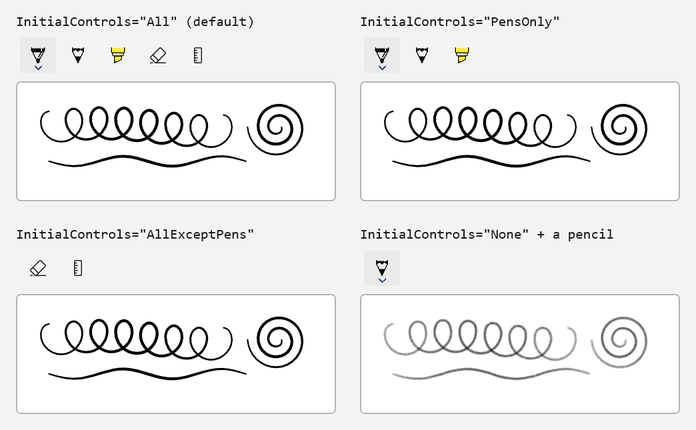
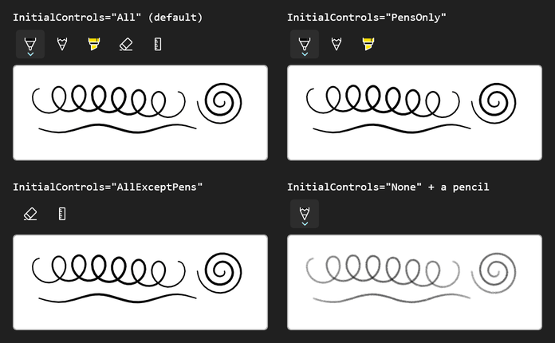

<!-- Copyright (c) Microsoft Corporation. All rights reserved. -->
<!-- Licensed under the MIT License. -->

# Pick the built-in buttons with InitialControls

`InkToolbar.InitialControls` decides which built-in buttons the toolbar creates for you. The options are `All`, `PensOnly`, `AllExceptPens` and `None`. Buttons you declare as children are added next to the built-in ones. This sample puts all four settings side by side, each driving its own small canvas.

| Light | Dark |
|---|---|
|  |  |

## Use it

1. Paste the XAML inside your page's root `Grid` (or any panel).
2. Add the `using` directives to the top of the code-behind file.
3. Paste the members into the page class and call `InitializeInking();` right after `InitializeComponent();` in the constructor.

### XAML

```xml
<Grid ColumnSpacing="24" RowSpacing="24">
    <Grid.ColumnDefinitions>
        <ColumnDefinition Width="Auto" />
        <ColumnDefinition Width="Auto" />
    </Grid.ColumnDefinitions>
    <Grid.RowDefinitions>
        <RowDefinition Height="Auto" />
        <RowDefinition Height="Auto" />
    </Grid.RowDefinitions>

    <StackPanel Spacing="4">
        <TextBlock FontFamily="Consolas" Text="InitialControls=&quot;All&quot; (default)" />
        <InkToolbar AutomationProperties.Name="All tools" InitialControls="All" TargetInkCanvas="{x:Bind AllCanvas}" />
        <Border Width="320" Height="120" Background="White" BorderBrush="#FFB4B4B4" BorderThickness="1" CornerRadius="4">
            <InkCanvas x:Name="AllCanvas" AutomationProperties.Name="Drawing surface for all tools" />
        </Border>
    </StackPanel>

    <StackPanel Grid.Column="1" Spacing="4">
        <TextBlock FontFamily="Consolas" Text="InitialControls=&quot;PensOnly&quot;" />
        <InkToolbar AutomationProperties.Name="Pens only" InitialControls="PensOnly" TargetInkCanvas="{x:Bind PensCanvas}" />
        <Border Width="320" Height="120" Background="White" BorderBrush="#FFB4B4B4" BorderThickness="1" CornerRadius="4">
            <InkCanvas x:Name="PensCanvas" AutomationProperties.Name="Drawing surface for pens only" />
        </Border>
    </StackPanel>

    <StackPanel Grid.Row="1" Spacing="4">
        <TextBlock FontFamily="Consolas" Text="InitialControls=&quot;AllExceptPens&quot;" />
        <InkToolbar AutomationProperties.Name="All tools except pens" InitialControls="AllExceptPens" TargetInkCanvas="{x:Bind NoPensCanvas}" />
        <Border Width="320" Height="120" Background="White" BorderBrush="#FFB4B4B4" BorderThickness="1" CornerRadius="4">
            <InkCanvas x:Name="NoPensCanvas" AutomationProperties.Name="Drawing surface without pens" />
        </Border>
    </StackPanel>

    <StackPanel Grid.Row="1" Grid.Column="1" Spacing="4">
        <TextBlock FontFamily="Consolas" Text="InitialControls=&quot;None&quot; + a pencil" />
        <InkToolbar AutomationProperties.Name="Pencil only" InitialControls="None" TargetInkCanvas="{x:Bind PencilCanvas}">
            <InkToolbarPencilButton AutomationProperties.Name="Pencil" />
        </InkToolbar>
        <Border Width="320" Height="120" Background="White" BorderBrush="#FFB4B4B4" BorderThickness="1" CornerRadius="4">
            <InkCanvas x:Name="PencilCanvas" AutomationProperties.Name="Drawing surface for the pencil" />
        </Border>
    </StackPanel>
</Grid>
```

### Usings

```csharp
using Microsoft.UI.Xaml.Controls;
using Windows.UI.Core;
```

### Code-behind

```csharp
private void InitializeInking()
{
    foreach (InkCanvas canvas in new[] { AllCanvas, PensCanvas, NoPensCanvas, PencilCanvas })
    {
        canvas.InkPresenter.InputDeviceTypes |= CoreInputDeviceTypes.Mouse | CoreInputDeviceTypes.Touch;
    }
}
```

## How it works

- `All` gives the ballpoint pen, pencil, highlighter, eraser and the stencil (ruler/protractor) menu.
- `PensOnly` keeps just the three pens. `AllExceptPens` keeps the eraser and stencil, so you can supply your own pen buttons.
- `None` starts with an empty toolbar. `InkToolbar.Children` is its content property, so any `InkToolbar*Button` placed inside the element is added there.
- Every toolbar needs its own `TargetInkCanvas` (or `TargetInkPresenter`). A single toolbar can't drive several canvases at once.

## Known limitations (Windows App SDK 2.4.1-experimental)

- The ruler and protractor in the stencil menu don't appear on the canvas yet.
