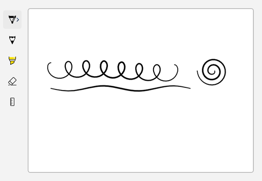
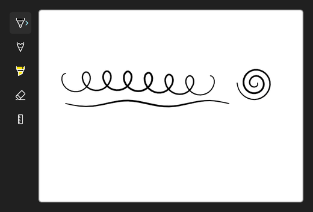

<!-- Copyright (c) Microsoft Corporation. All rights reserved. -->
<!-- Licensed under the MIT License. -->

# Dock the toolbar vertically

Set `Orientation="Vertical"` to stack the tool buttons in a column. That fits layouts where the toolbar sits along the side of the drawing area, which leaves more height for ink.

| Light | Dark |
|---|---|
|  |  |

## Use it

1. Paste the XAML inside your page's root `Grid` (or any panel).
2. Add the `using` directives to the top of the code-behind file.
3. Paste the members into the page class and call `InitializeInking();` right after `InitializeComponent();` in the constructor.

### XAML

```xml
<Grid HorizontalAlignment="Left" ColumnSpacing="8">
    <Grid.ColumnDefinitions>
        <ColumnDefinition Width="Auto" />
        <ColumnDefinition Width="Auto" />
    </Grid.ColumnDefinitions>
    <InkToolbar
        VerticalAlignment="Top"
        AutomationProperties.Name="Ink tools"
        Orientation="Vertical"
        TargetInkCanvas="{x:Bind InkSurface}" />
    <Border
        Grid.Column="1"
        Width="440"
        Height="320"
        VerticalAlignment="Top"
        Background="White"
        BorderBrush="#FFB4B4B4"
        BorderThickness="1"
        CornerRadius="4">
        <InkCanvas x:Name="InkSurface" AutomationProperties.Name="Drawing surface" />
    </Border>
</Grid>
```

### Usings

```csharp
using Windows.UI.Core;
```

### Code-behind

```csharp
private void InitializeInking()
{
    InkSurface.InkPresenter.InputDeviceTypes |= CoreInputDeviceTypes.Mouse | CoreInputDeviceTypes.Touch;
}
```

## How it works

- `Orientation` only changes how the toolbar lays out its buttons. The tools behave the same in both orientations.
- The toolbar and canvas sit in separate columns so the toolbar never covers ink. Setting `VerticalAlignment="Top"` keeps the buttons from stretching across the canvas height.
